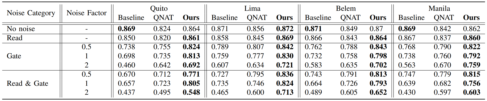

### QuST: Optimizing Quantum Neural Network against Spatial and Temporal Noise Biases

Table: Test MNIST-4 with various noise magnitudes, averaging results over 30 days randomly sampled from 190 days.

## Evaluation on Different Noise Magnitudes

To examine the variations in model performance under various noise magnitudes, we conduct tests in 4 noise configurations: 'No noise', 'Read' noise, 'Gate' noise, and 'Read & Gate' noise. The 'Gate' and 'Read & Gate' configurations include noise factors with values of $F=\{0.5, 1, 2\}$. The results are summarized in the above Table, compared with 'No noise' accuracy. 

(i) Under 'Read' noise, the accuracy loss of the three methods is about 1%$\sim$2%, because the readout error probabilities of IBMQ is relatively stable, usually less than 1%.

(ii) Under 'Gate' noise with a noise factor $F=0.5$, Baseline's accuracy drops by an average of 10.6%, while QuantumNAT and QuST show smaller reductions of 5.8% and 3.4%, respectively. As the 'Gate' noise magnitude increases, the accuracy of Baseline, QuantumNAT, and QuST is reduced by an average of 13.8%, 8.5% and 5.9% ($F=1$) and 31.7%, 19.8%, and 14.9% ($F=2$), respectively.

(iii) When testing 'Gate & Read' noise with a noise factor of $F=0.5$, \replaced{Baseline's accuracy drops by 14.8%, while QuantumNAT and QuST show smaller reductions of 7.4% and 5.8%. At $F=1$, the accuracy drops are 19.6%, 12.4%, and 7.3% for Baseline, QuantumNAT, and QuST. At the highest noise factor of $F=2$, the reductions are 41.5%, 26.9%, and 23.8%, respectively.}{Baseline's accuracy drops by an average of 14.8%, while QuantumNAT and QuST show smaller reductions of 7.4% and 5.8%, respectively. As the magnitude of "Gate & Read" noise increases, at $F=1$, the accuracy reductions are approximately 19.6%, 12.4%, and 7.3% for Baseline, QuantumNAT, and QuST, respectively. At the highest noise factor of $F=2$, these reductions become more significant, with accuracy drops of 41.5%, 26.9%, and 23.8% for Baseline, QuantumNAT, and QuST, respectively.}

By assessing accuracy under different noise magnitudes for these four noise configurations, our model showcases strong noise resilience with minimal accuracy deterioration. For example, under 'Read & Gate' noise, compared with Baseline and QuantumNAT, QuST average improved by 12.72% and 5.66% averaging over $F=\{0.5, 1, 2\}$.